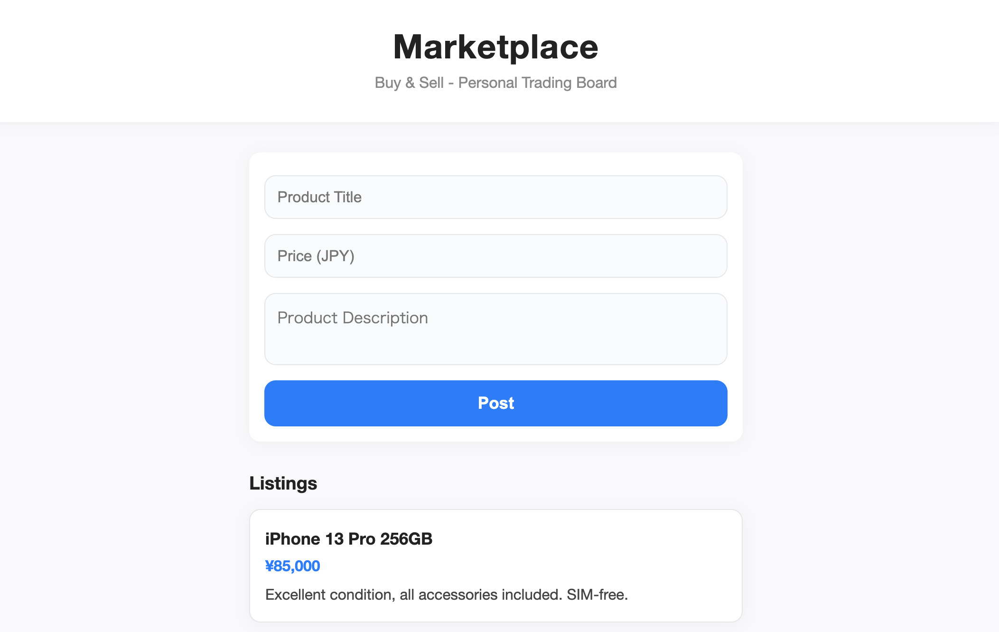

# 🚀 Marketplace

A **minimalist, modern, and professional** Buy & Sell board for personal trading. Instantly post, browse, and manage listings with a sleek UI. Perfect for demo, learning, or as a project starter!

---

---

## ✨ Features

- 🖥️ **Minimalist & Stylish UI** — Clean, responsive, and modern design
- ⚡ **Instant Posting** — Add new listings in seconds
- 📱 **Mobile Friendly** — Looks great on any device
- 💾 **Local Storage** — All data is saved in your browser (no backend required)
- 🌐 **English UI** — All interface and sample data in English
- 🧑‍💻 **Easy to Customize** — Simple codebase for quick adaptation

---

## 📸 Demo

> Open `index.html` in your browser and start using Marketplace instantly!

---

## 🛠️ Tech Stack

- **HTML5**
- **CSS3** (modern, minimalist styling)
- **JavaScript (ES6+)**
- No frameworks, no build tools — just pure web standards

---

## 🚦 How to Use

1. **Clone or Download** this repository
2. Open `index.html` in your browser
3. Add, browse, and manage your listings!

> All data is stored in your browser. Refreshing the page keeps your posts. To reset, clear your browser's local storage.

---

## 📝 Example Listings

- iPhone 13 Pro 256GB
- MacBook Air M1
- Nintendo Switch
- AirPods Pro 2nd Gen
- ...and more!

---

## 🎨 Customization

- Edit `style.css` for your own color scheme or branding
- Modify `app.js` to add features (e.g., image upload, search, categories)
- Replace or expand the sample data as you like

---

## 🤝 Contributing

Pull requests are welcome! For major changes, please open an issue first to discuss what you would like to change.

---

## 📄 License

This project is licensed under the MIT License.

---

## 💡 Inspiration

Marketplace is designed as a clean, professional template for learning, prototyping, or launching your own buy & sell board. Enjoy building! 